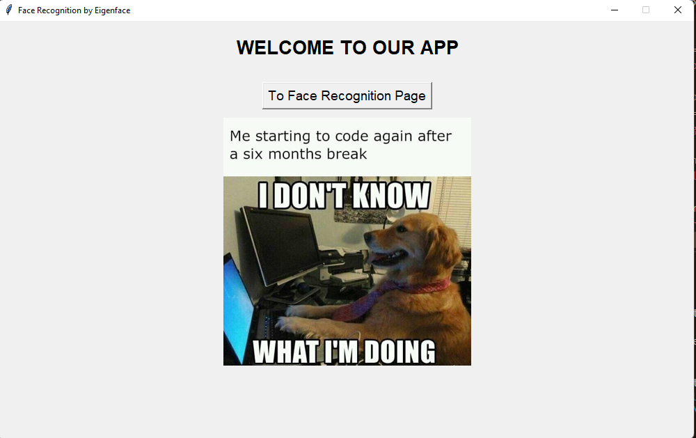

# Face Recognition Using Eigenface
>Tugas ini merupakan salah satu tugas besar matakuliah IF2123 Aljabar Linier dan Geometri yang berfokus pada pengaplikasian PCA (Principal Component Analysis) untuk mencari Eigenface yang kemudian akan digunakan untuk menentukan kemiripan suatu gambar (dalam kasus ini kemiripan muka, face recognition).

## Table of Contents
* [General Info](#general-information)
* [Technologies Used](#technologies-used)
* [Dependencies](#dependencies)
* [Features](#features)
* [Screenshots](#screenshots)
* [Setup](#setup)
* [Usage](#usage)
* [Project Status](#project-status)
* [Room for Improvement](#room-for-improvement)

## General Information
- Tugas ini merupakan salah satu bentuk pengaplikasian PCA (Principal Component Analysis) dan Eigenface yang memerlukan pemahaman mendalam tentang nilai eigen, vektor eigen, dan ruang eigen. Objektif dari tugas ini adalah untuk menentukan gambar pada database mana yang paling cocok dengan gambar uji.

## Technologies Used
- Python - version 3.10.6

## Dependencies
- Tkinter - pip install tk
- NumPy   - pip install numpy
- OpenCV  - pip install opencv-python

## Features
- Pencarian wajah tercocok berdasarkan gambar uji
- Pengambilan wajah melalui webcam dan pencarian gambar tercocok (Bonus)

## Screenshots

## Setup
- Jika belum mempunyai Python versi 3.10.6 lakukan penginstallan terlebih dahulu.
- Lakukan instalasi dependencies (Tkinter, NumPy, dan OpenCV).

## Usage
How does one go about using it?
Provide various use cases and code examples here.

`write-your-code-here`

## Project Status
Project is: _complete_

## Room for Improvement
- Menurunkan waktu pemrosesan pencocokan wajah dengan optimisasi algoritma QR untuk mencari vektor eigen.
